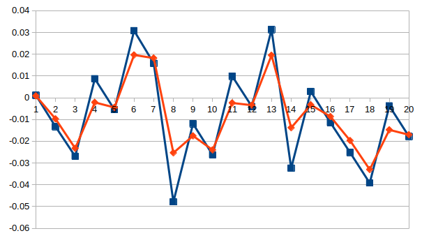

# Kalman filter based on C++
* This project gives an example, which can be modified by users.      
* Every block during `option start` and `option end` should be modified by users according to the actual situation, where 
contains necessary parameters and printing options.    
* Need to pre install dependency `Eigen`:    
  `sudo apt-get install libeigen3-dev`      
  `sudo ln -s /usr/include/eigen3/Eigen /usr/include/Eigen`    
* The random number generation mechanism based on time stamp is used to simulate the noise of 
sensors, this rough approach has produced good results.
* Provide simple parameter type checking function.
* The test result is as the follow figure, the red line is the filtered result and the blue line is 
the origin measurement result, the number of iterations is 20:     

  

* Reference:    
 [手把手教你写卡尔曼滤波器](https://zhuanlan.zhihu.com/p/45238681)     
